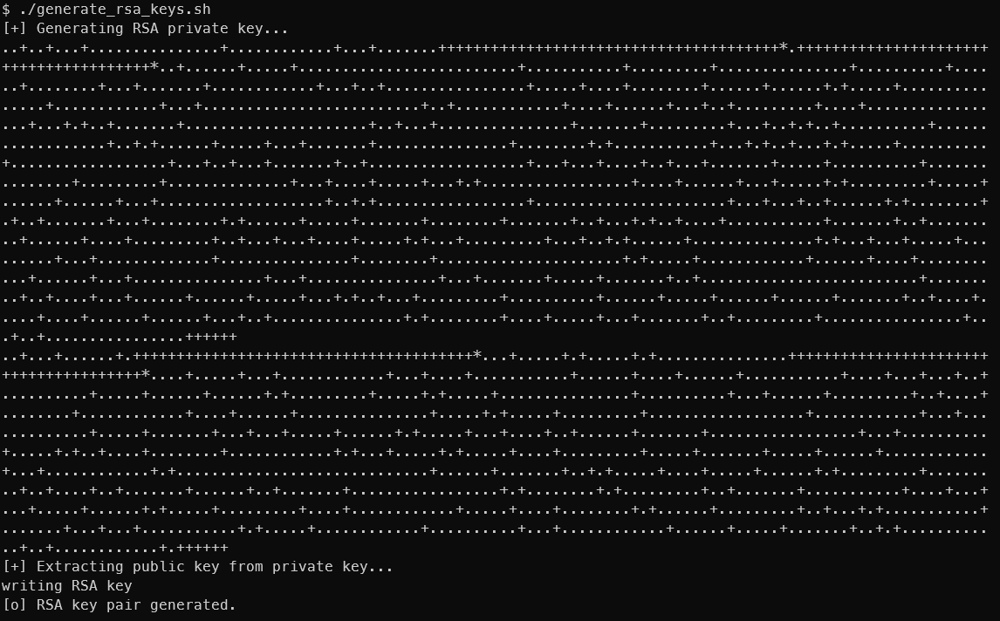
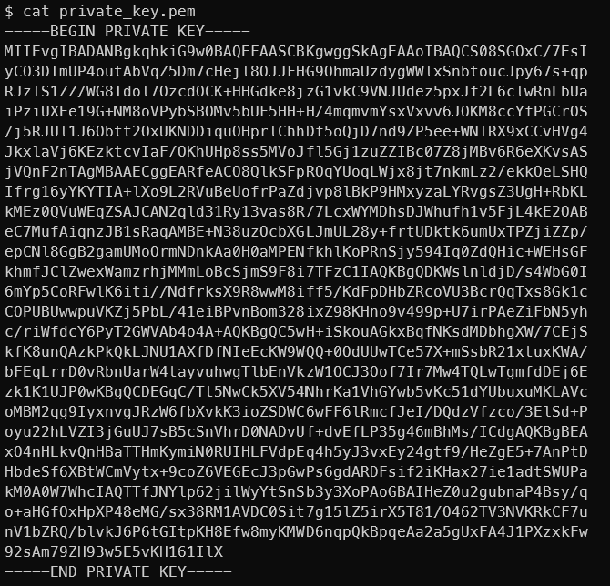
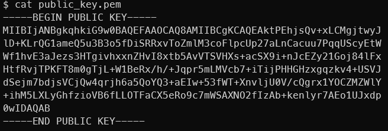

# RSA Key Generation Example

This shows how to generate an RSA key pair using OpenSSL.

## Commands

```bash
openssl genpkey -algorithm RSA -out private_key.pem -pkeyopt rsa_keygen_bits:2048
openssl rsa -pubout -in private_key.pem -out public_key.pem



